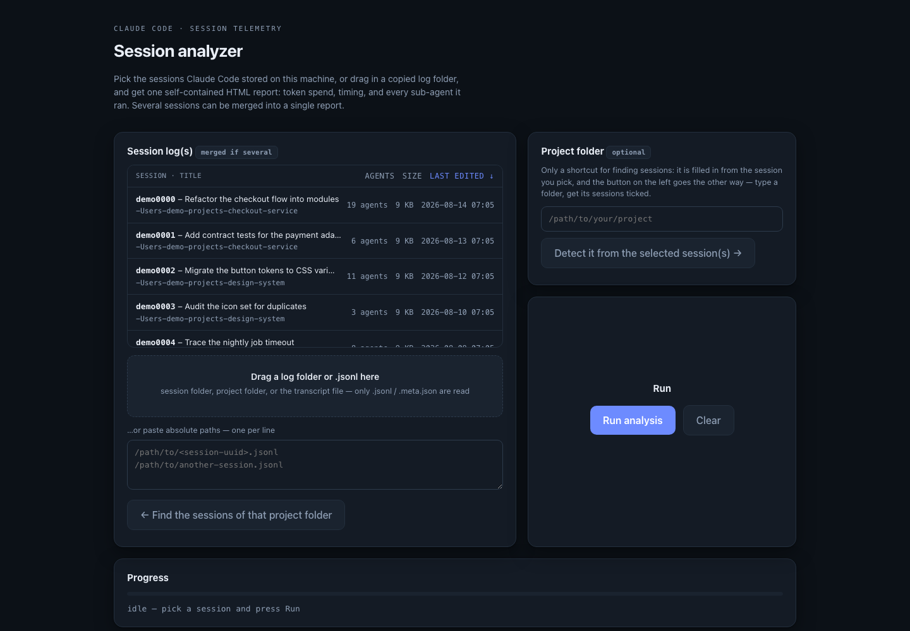
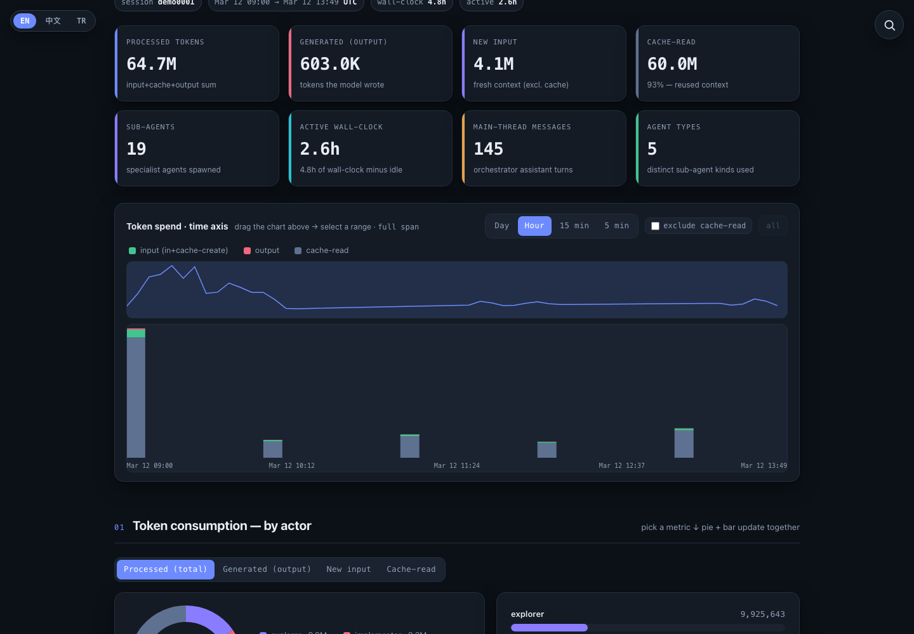
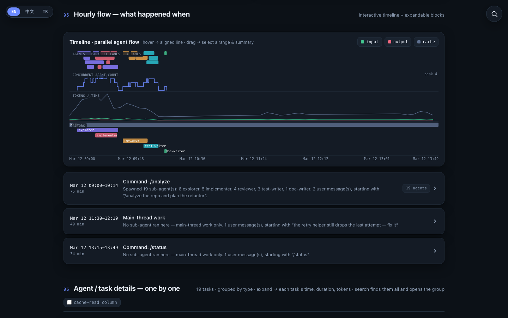
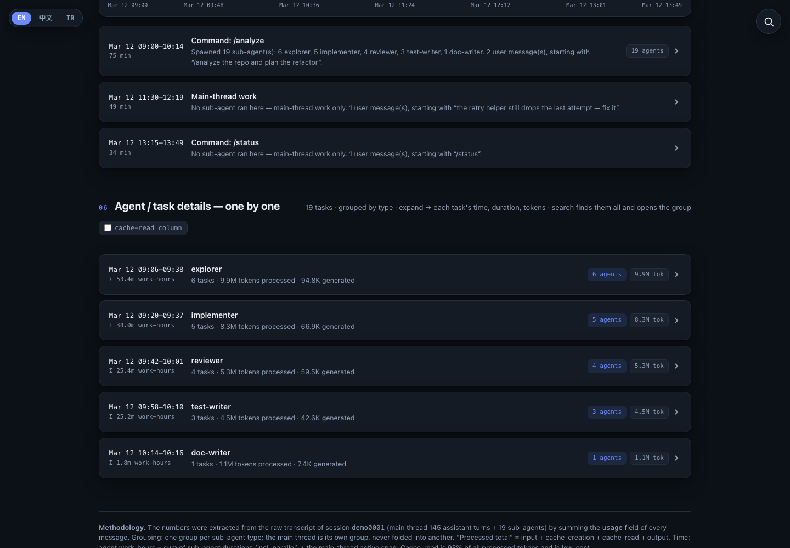

<h1 align="center">session-analyzer</h1>

<p align="center">
  <b>See where a Claude Code session actually went.</b><br>
  Tokens per actor, three honest time measures, every sub-agent on a timeline — from the
  transcript the CLI already wrote on your machine.
</p>

<p align="center">
  <a href="https://agent-session-report.vercel.app"></a>
  <a href="https://agent-session-report.vercel.app/docs"></a>
  <a href="https://agent-session-report.vercel.app/demo-report"></a>
</p>

<p align="center">
  
  
  
  
  <a href="LICENSE"></a>
</p>

<p align="center">
  
  
  
  
  
</p>

<p align="center">
  
</p>

---

## Two ways to run it

**Locally** — this branch. One Python file, no dependencies, nothing leaves the machine:

```bash
python3 serve_report.py     # session picker at http://127.0.0.1:8799
```

**In a browser** — **[agent-session-report.vercel.app](https://agent-session-report.vercel.app)**.
Drop a session log on the page; the analysis runs in your tab, with no upload and no backend.
That build lives on the [`web`](../../tree/web) branch.

Curious first? Open the **[sample report](https://agent-session-report.vercel.app/demo-report)** —
built from a synthetic session, so it shows everything without publishing anyone's transcript.
Every screenshot below comes from it.

## The launcher

1. Tick a session in the list (read from `~/.claude/projects`), or drag a copied log folder /
   `.jsonl` onto the drop zone. Ticking several **merges them into one report** — what you want when
   a piece of work spanned `/resume`s, a crash, or several days.
2. Press **Run analysis**, then **Open the report ↗**.

The **Project folder** box is a shortcut for finding sessions in both directions: it fills in from the
session you pick (read from the `cwd` the transcript recorded), and the button on the left goes the
other way — type a folder, get its sessions ticked.

List tips: click the `agents` / `size` / `last edited` headers to sort (click again to flip), click a
row to toggle, shift-click for a range, or drag a selection box over the rows — hold
<kbd>ctrl</kbd>/<kbd>cmd</kbd> while dragging to deselect instead.

## Or straight from the command line

```bash
python3 analyze_and_report.py                 # busiest session of the current folder's project
python3 analyze_and_report.py <session-uuid>  # one specific session
python3 analyze_and_report.py a.jsonl b.jsonl # several sessions, merged into one report
python3 analyze_and_report.py --list          # what is available for this folder
python3 analyze_and_report.py --out ./out     # where to write (default: next to the script)
```

Three files come out: `report.html` (open this), plus `report-data.json` and `viewdata.json` — the
raw aggregates, if you want to chart them somewhere else.

## What the report shows

<p align="center">
  
</p>

- **Tokens, split by actor** — the main thread and each sub-agent type, switchable between processed
  total, generated output, new input and cache-read.
- **Three time measures, kept apart** — wall-clock, active wall-clock (idle removed), and agent
  work-hours (parallel agents summed separately). Conflating these is how session numbers get misread.
- **Token spend over time** — drag the chart to zoom into any window and read its totals.
- **The parallel-agent flow** — concurrency lanes, agent count, tokens on the same axis, one row per actor.

<p align="center">
  
</p>

- **Every task as a row** — description, type, model, start–end, duration, turns, tokens; sortable and
  searchable with regex.
- **Activity blocks** — the run split on 20-minute idle gaps, each listing what was spawned and which
  commands were typed.

<p align="center">
  
</p>

## Languages

**EN · 中文 · TR** — the launcher and every generated report ship in all three, switchable in the
top-left corner, and the choice is remembered.

<sub><i>Other languages are welcome — a translation is one entry in the `T` table of
`analyze_and_report.py`; pull requests are open.</i></sub>

## How the numbers are produced

| Number | Definition |
|---|---|
| processed tokens | `input + cache-creation + cache-read + output`, from the `usage` field of every assistant message |
| generated | output tokens only — what the model actually wrote |
| new input | `input + cache-creation` — context paid for at full price |
| sub-agents | one per `*.meta.json` under `<session-uuid>/subagents/`, with tokens from its own transcript |
| grouping | one group per agent type; the main thread is its own group, never folded into another |
| ① wall-clock | first timestamp to last |
| ② active wall-clock | the same span minus idle gaps longer than 20 minutes |
| ③ agent work-hours | every sub-agent's duration summed (parallel included) + the main thread's active span |

③ being larger than ② is not a bug: ten agents working an hour in parallel are one hour of calendar
time and ten hours of agent work. Cache-read usually dominates the processed total — long context is
re-read every turn, which is expected and cheap; switch the metric to **Generated** or **New input**
for the real load.

## Privacy

Everything runs on your machine: the launcher binds to `127.0.0.1`, the report is a local HTML file,
and nothing is uploaded anywhere.

> A generated report **contains your session**: task descriptions, typed commands, the first line of
> your prompts. Treat `report.html` like the transcript it came from before sharing it.

## Files

| Path | Role |
|---|---|
| `analyze_and_report.py` | the analyzer and the report renderer — runs standalone, stdlib only |
| `serve_report.py` | local launcher: session list, drag-and-drop, calls the analyzer |
| `index.html` | the launcher page |
| `tools/demo_session.py` | builds the synthetic session behind the sample report |
| `tools/launcher_shot.py` | screenshots the launcher against a fake `HOME`, never a real session list |

## Troubleshooting

- **The list is empty** — no logs under `~/.claude/projects` on this machine. Drag a copied log
  folder in instead.
- **The project folder is not detected** — the session ran on another machine, so the path recorded
  in the transcript does not exist here. Type it in, or ignore it.
- **Port already in use** — the launcher walks up from 8799 until a port is free and prints the
  address it picked. `PORT=9000 python3 serve_report.py` overrides it.

## License

MIT — see [LICENSE](LICENSE).
