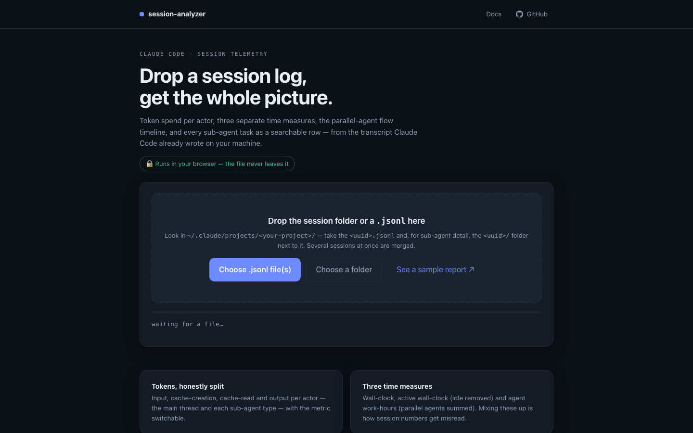

<h1 align="center">session-analyzer</h1>

<p align="center">
  <b>See where a Claude Code session actually went.</b><br>
  Tokens per actor, three honest time measures, every sub-agent on a timeline — from the
  transcript the CLI already wrote on your machine.
</p>

<p align="center">
  <a href="https://agent-session-report.vercel.app"></a>
  <a href="https://agent-session-report.vercel.app/docs"></a>
  <a href="https://agent-session-report.vercel.app/demo-report"></a>
</p>

<p align="center">
  
  
  
  
  <a href="LICENSE"></a>
</p>

<p align="center">
  
  
  
  
  
</p>

<p align="center">
  
</p>

---

## Try it

**[agent-session-report.vercel.app](https://agent-session-report.vercel.app)** — drop a session log,
read the report. The analysis runs **in your browser**: the file is never uploaded, and the site has
no backend to upload it to.

Prefer to keep it local? The same analyzer is a single Python file with no dependencies, and it
comes with a session picker:

```bash
python3 serve_report.py                  # session picker at http://127.0.0.1:8799
python3 analyze_and_report.py            # or straight to a report, no UI
python3 analyze_and_report.py --list     # what is available here
```

<p align="center">
  
</p>

In the launcher: tick a session (read from `~/.claude/projects`) or drag a copied log folder in;
ticking several **merges them into one report**. Sort by the `agents` / `size` / `last edited`
headers, shift-click for a range, or drag a selection box over the rows —
<kbd>ctrl</kbd>/<kbd>cmd</kbd> while dragging deselects. The **Project folder** box finds sessions
in both directions: it fills in from the session you pick, and its button goes the other way.

Curious first? Open the **[sample report](https://agent-session-report.vercel.app/demo-report)** —
built from a synthetic session, so it shows everything without publishing anyone's transcript.
Every screenshot in this README comes from it.

## What you get

<p align="center">
  
</p>

- **Tokens, split by actor** — the main thread and each sub-agent type, switchable between processed
  total, generated output, new input and cache-read.
- **Three time measures, kept apart** — wall-clock, active wall-clock (idle removed), and agent
  work-hours (parallel agents summed separately). Conflating these is how session numbers get misread.
- **Token spend over time** — drag the chart to zoom into any window and read its totals.
- **The parallel-agent flow** — concurrency lanes, agent count, tokens on the same axis, one row per actor.

<p align="center">
  
</p>

- **Every task as a row** — description, type, model, start–end, duration, turns, tokens; sortable and
  searchable with regex.
- **Activity blocks** — the run split on 20-minute idle gaps, each listing what was spawned and which
  commands were typed.

<p align="center">
  
</p>

## Languages

**EN · 中文 · TR** — the interface and every generated report ship in all three, switchable in the
top-left corner, and the choice is remembered.

<sub><i>Other languages are welcome — a translation is one entry in the `T` table of
`analyze_and_report.py`; pull requests are open.</i></sub>

## How the numbers are produced

| Number | Definition |
|---|---|
| processed tokens | `input + cache-creation + cache-read + output`, from the `usage` field of every assistant message |
| generated | output tokens only — what the model actually wrote |
| new input | `input + cache-creation` — context paid for at full price |
| sub-agents | one per `*.meta.json` under `<session>/subagents/`, with tokens from its own transcript |
| grouping | one group per agent type; the main thread is its own group, never folded into another |
| ① wall-clock | first timestamp to last |
| ② active wall-clock | the same span minus idle gaps longer than 20 minutes |
| ③ agent work-hours | every sub-agent's duration summed (parallel included) + the main thread's active span |

③ being larger than ② is not a bug: ten agents working an hour in parallel are one hour of calendar
time and ten hours of agent work. Full detail in the [docs](https://agent-session-report.vercel.app/docs).

## Privacy

Nothing is uploaded, anywhere, in either version — the CLI is local by definition, and the web build
is a static page that reads your file with the File API and analyses it in the tab.

> A generated report **contains your session**: task descriptions, typed commands, the first line of
> your prompts. Treat `report.html` like the transcript it came from before sharing it.

## Repository layout

Single branch, two entry points: the Python tool at the root, and the static site under `web/`
(that folder is the deploy root, so a push to `main` publishes it).

| Path | Role |
|---|---|
| `analyze_and_report.py` | the analyzer and the report renderer — standalone, stdlib only |
| `serve_report.py` | local launcher: session list, drag-and-drop, calls the analyzer |
| `web/analyze.js` | the browser port of the aggregation |
| `web/report-assets.js` | **generated** — the renderer, compiled out of the Python file |
| `build_web.py` | regenerates `web/report-assets.js` |
| `tests/conformance.mjs` | runs both analyzers over one transcript and fails on any difference |
| `tools/demo_session.py` | builds the synthetic session behind the sample report |
| `tools/screenshots.py`, `tools/launcher_shot.py` | regenerate the images used here |
| `web/vercel.json` | static-site config: clean URLs and a strict Content-Security-Policy |

## Development

```bash
python3 build_web.py                        # renderer -> web/report-assets.js
python3 -m http.server -d web 8815          # try the site locally
node tests/conformance.mjs <session.jsonl>  # JS and Python must agree, field for field
python3 tools/demo_session.py               # rebuild the sample report
```

The renderer has exactly one source (`analyze_and_report.py`); the aggregation has two (Python and
JS), and the conformance test is what keeps them honest. Run it after touching either side.

## License

MIT — see [LICENSE](LICENSE).
